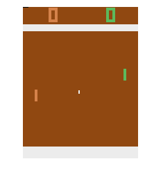
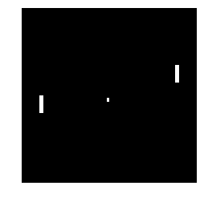
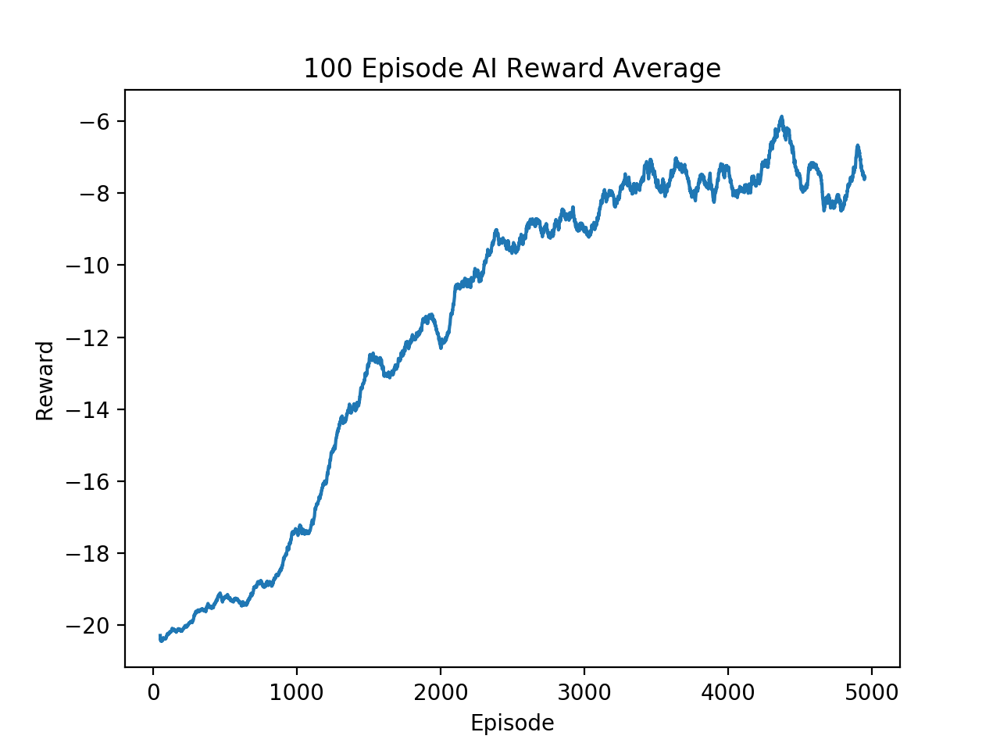

This post will walk through training a pong AI using policy gradients, a type of reenforcement learning. This model continually  plays against a hard coded AI, using a neural net to decide on the move it makes. As it plays, it's actions are rewarded if they produce a score and discouraged if the opponent scores. Over time the idea is that the AI's move will become better and better as good play is encouraged.

<video autoplay loop>
    <source src="img/pong_movie.mp4" type="video/mp4"/>
</video>

Code based on [this](http://karpathy.github.io/2016/05/31/rl/) blog post.

# Setup

Let's first look at how the environment in which our AI will be learning is set up. We'll be using OpenAI's gym module to simulate an opponent. Once we create our environment, we can step our environment with one of three moves, do nothing, move up, and move down. After each move a screenshot of the game is returned; this is what our AI will be basing its actions off of.

However, we won't be giving the raw screenshots to our neural net; we'll first do some preprocessing where we remove all the data except the paddles and the ball. Also, we'll actually send the difference between consecutive processed frames since that gives a better sense of movement.

:::{.center}
| Raw                   | Processed                   |
|:---------------------:|:---------------------------:|
|  |  |
:::

```python
import gym
import numpy as np

# Make our game
env = gym.make("Pong-v0")
observation = env.reset()

def preprocess(I):
    """ Process 210x160x3 uint8 frame into 6400 (80x80) 1D float vector.
    """
    I = I[35:195]    # Crop
    I = I[::2,::2,0] # Downsample by factor of 2
    I[I == 144] = 0  # Erase background (background type 1)
    I[I == 109] = 0  # Erase background (background type 2)
    I[I != 0] = 1    # Everything else (paddles, ball) set to 1
    return I.astype(np.float).ravel() # Flatten
```

# Building the Model

Now that we know what our input looks like, lets build our model. We're going to just use a basic feed forward neural net with a ReLU hidden layer of 200, outputting a probability distribution over the possible moves our AI can make.

```python
import tensorflow as tf

IMAGE_SIZE = 80 * 80
HIDDEN_SIZE = 200
N_ACTIONS = 3

# Input image
X = tf.placeholder(dtype=tf.float32, shape=[None, IMAGE_SIZE],name="X")
# Output action
Y = tf.placeholder(dtype=tf.float32, shape=[None, N_ACTIONS],name="Y")

# Weight vectors
W1 = tf.get_variable("W1", [IMAGE_SIZE, HIDDEN_SIZE],
                     initializer=tf.contrib.layers.xavier_initializer())
W2 = tf.get_variable("W2", [HIDDEN_SIZE, N_ACTIONS],
                     initializer=tf.contrib.layers.xavier_initializer())

hidden = tf.nn.relu(tf.matmul(X, W1))
logits = tf.matmul(hidden, W2)
prob = tf.nn.softmax(logits)
```

# Policy Gradients

So we have our model, but what do we calculate our loss against and how do we train? Unlike a problem such as MNIST classification where you're assigning a digit to an image, whether or not a move was "good" or "bad" for a given game state is harder to determine. However, the idea behind policy gradients is we do the following:

1. While the game is not over:
    - Take in a screenshot and output a distribution over actions.
    - Sample an action from the distribution and perform it, receiving an immediate reward.
        - +1 if AI scores, -1 if opponent scores, 0 otherwise.
    - Save the input, action performed, and immediate reward received.
2. When the game is over, compute a total reward for each action that is a linear combination of all rewards after it.
    - Weight rewards that occur more directly after an action more in its total reward.
    - Normalize the mean and variance of the total rewards.
3. Encourage or discourage each action taken for its input by using the total reward as a gradient to back propagate through the network.

e.g. This very short game

| Move | Action | Reward | Total Reward                                                   | Total Reward $(\gamma = 0.5)$ | ~Normalized Total Rewards |
|:-----|:-------|:-------|:---------------------------------------------------------------|:------------------------------|:--------------------------|
| 1    | UP     | +1     | $-1 \times \gamma^3 + 0 \times \gamma^2 + 1 \times \gamma + 1$ | +1.375                        | +1.112                    |
| 2    | NOTHING| +1     | $-1 \times \gamma^2 + 0 \times \gamma + 1$                     | +0.75                         | +0.542                    |
| 3    | DOWN   | 0      | $-1 \times \gamma + 0$                                         | -0.5                          | -0.599                    |
| 4    | UP     | -1     | $-1$                                                           | -1                            | -1.055                    |

Note: $\gamma$ is the parameter we use to control how heavily we weight later rewards. $\gamma = 1$ would weight all rewards equally, $\gamma = 0$ would make the total reward equal to only immediate reward.

## Loss & Optimization

```python
LEARNING_RATE = 1e-3
GAMMA = 0.99

# Loss between taken action & distribution
loss = tf.nn.softmax_cross_entropy_with_logits(logits=logits, labels=Y)
immediate_rewards = tf.placeholder(dtype=tf.float32, shape=[None,1], name="immediate_rewards")

# Function weighting our rewards
discount_f = lambda accum, val: accum * GAMMA + val;
total_rewards_reversed = tf.scan(discount_f, tf.reverse(immediate_rewards, [True, False]))
total_rewards = tf.reverse(total_rewards_reversed, [True, False])

# Normalize discounted_epr to standard mean and variance
mean, variance = tf.nn.moments(total_rewards, [0], shift=None, name="total_reward_moments")
total_rewards -= mean
total_rewards /= tf.sqrt(variance + 1e-6)

# Optimizer
optimizer = tf.train.AdamOptimizer(LEARNING_RATE)
# Use normalized_rewards for loss gradient
grads = optimizer.compute_gradients(loss, grad_loss=total_rewards)
train_op = optimizer.apply_gradients(grads)
```

## Training

```python
with tf.Session() as sess:
    # Initialize our variables
    sess.run(tf.global_variables_initializer())

    # Last image
    prev_x = None

    # Histories
    x_hist, reward_hist, y_hist = [],[],[]

    # Game vars
    running_reward = None
    reward_sum = 0
    episode_number = 0

    while True:
        # Preprocess the observation
        cur_x = preprocess(observation)

        # Set input to different between current and last image
        x = cur_x - prev_x if prev_x is not None else np.zeros(IMAGE_SIZE)
        prev_x = cur_x

        # Get prob dist for given image
        feed = { X: np.reshape(x, (1,-1)) }
        sample_prob = sess.run(prob, feed)
        sample_prob = sample_prob[0,:]

        # Stochastically sample a policy
        action = np.random.choice(N_ACTIONS, p=sample_prob)
        label = np.zeros_like(sample_prob)
        label[action] = 1

        # Step the environment
        observation, reward, done, info = env.step(action+1)
        reward_sum += reward

        # Record game history
        x_hist.append(x)
        y_hist.append(label)
        reward_hist.append(reward)

        if done:
            # Update running reward
            if running_reward is None:
                running_reward = reward_sum
            else:
                running_reward = running_reward * 0.99 + reward_sum * 0.01

            # Update parameters
            feed = {X: np.vstack(x_hist),
                    immediate_rewards: np.vstack(reward_hist),
                    Y: np.vstack(y_hist)}
            _ = sess.run(train_op,feed)

            # Print out progress
            if episode_number % 10 == 0:
                print('ep {}: reward: {}, mean reward: {:3f}'.format(
                    episode_number, reward_sum, running_reward))
            else:
                print('\tep {}: reward: {}'.format(episode_number, reward_sum))

            # Reset game vars
            x_hist, reward_hist, y_hist = [],[],[] # reset game history
            observation = env.reset() # reset env
            reward_sum = 0
```

# Results

One thing to know about this model is it takes a long time to train, simulating the games is slow (at least in OpenAI gym). I trained the model for 5000 episodes, taking about a day on my MacBook Pro. It definitely improved a lot as you can see below, but still did not consistently win against the AI. There are a lot of improvements that could be made to this model, mainly replacing the feed-forward net with a convolutional one.



<div class="center">
<figure>
<figcaption>After 100 episodes</figcaption>
<video autoplay loop>
    <source src="img/bad_pong.mp4" type="video/mp4" />
</video>
</figure>

<figure>
<figcaption>After 5000 episodes</figcaption>
<video autoplay loop>
    <source src="img/pong_movie.mp4" type="video/mp4" />
</video>
</figure>
</div>
