One cool application of GANs is image translation. The task is given pairs of images, can you learn to generate the output image from an input. Examples of this task would be turning satelite images into maps or coloring black and white photos. In this post we're going to walk through the [pix2pix model by Isola et al.](https://arxiv.org/abs/1611.07004)

](img/trans.jpg)

Code adapted from [affinelayer's TensorFlow implementation](https://github.com/affinelayer/pix2pix-tensorflow). I would highly recommend checking out [his post](https://affinelayer.com/pix2pix/) for a high-level overview of how the model works. This post is more meant to walk through the code line-by-line.

## Load Data

First lets load in our data. To start we're going to work with the facades dataset. The input image will be a labeled version of the second picture of a building facade, with different colors representing different features like windows, doors, etc. Our goal will be to produce the second image from the first.

Unlike prior posts, we're going to use some of TensorFlow's utilities for loading in data. We get our list of files, put them into a queue, and have a `WholeFileReader` read and decode each. Although this is a bit more cumbersome than using placeholders, from what I've read it can lead to speed up training when working with large amounts of data. It also has the effect of making the loading in of data be a part of the model itself, which is interesting.


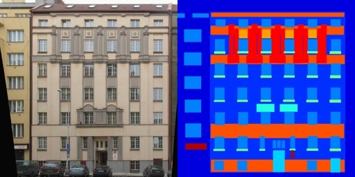

The format of these images is the first half is the target photo, and the second half is the annotated version. We'll preprocess the image to have pixel values between $[-1, 1]$ and then cut it in half, assigning the first part to our target and the second to our input (flipped since we're mapping labeled $\rightarrow$ photo).

One additional thing we'll do it crop down the images from SCALE_SIZE to CROP_SIZE at a random offset. This is just what the authors describe doing in the paper, however it makes sense as a form of regularization.

```python
import tensorflow as tf
import glob
import math
import os
import random

# Size to scale to
SCALE_SIZE = 286
# Size to crop to after scaling
CROP_SIZE = 256
def process_image(image, seed):
    """ Process image to be inputted to model.
     Scales pixels to [-1, 1] and crops to CROP_SIZE from SCALE_SIZE randomly.
     """
    # [0, 1] => [-1, 1]
    image = image * 2 - 1

    # Scale down to SCALE_SIZE
    image = tf.image.resize_images(
                        image,
                        [SCALE_SIZE, SCALE_SIZE],
                        method=tf.image.ResizeMethod.AREA
                    )

    # Choose random offset from corner and crop to CROP_SIZE from it
    offset = tf.cast(
                tf.floor(
                    tf.random_uniform([2], 0, SCALE_SIZE - CROP_SIZE + 1, seed=seed)
                ), dtype=tf.int32)
    image = tf.image.crop_to_bounding_box(image, offset[0], offset[1], CROP_SIZE, CROP_SIZE)
    return image

BATCH_SIZE = 1
def load_data(path):
    """ Loads data from path. """
    # All jpgs
    input_paths = glob.glob(os.path.join(path, '*.jpg'))

    # Data pipeline
    path_queue = tf.train.string_input_producer(input_paths, shuffle=True)
    reader = tf.WholeFileReader()
    paths, contents = reader.read(path_queue)
    raw_image = tf.image.decode_jpeg(contents)
    raw_image = tf.image.convert_image_dtype(raw_image, dtype=tf.float32)
    raw_image.set_shape([None, None, 3])

    # Split image into left and right side
    width = tf.shape(raw_image)[1]
    left, right = raw_image[:, :width // 2, :], raw_image[:, width // 2:, :]

    # Process image.
    # Use same seed for left & right so both get cropped the same
    seed = random.randint(0, 2 ** 31 - 1)
    left = process_image(left, seed)
    right = process_image(right, seed)

    # Assign sides to input/target
    inputs, targets = right, left

    # Create batches
    paths, inputs, targets = tf.train.batch([paths, inputs, targets], batch_size=BATCH_SIZE)
    steps_per_epoch = int(math.ceil(len(input_paths) / BATCH_SIZE))
    return paths, inputs, targets, steps_per_epoch
```

## Some Helper Functions

Before we start building the model, there are a couple functions we'll be using that we should define.

Note that I'm wrapping a lot of these calls with `tf.variable_scope`. What this does is creates a namespace around the variables we define. This can be important when we have multiple variables with the same name, like "filter" for example, but want them to be distinct parameters when training.

### Conv & Deconv

Deconvolution (or Transposed Convolution) was new to me. Normally when performing convolution, we're applying filters in such a way that we decrease the size of our image, effectively downsampling it. Deconvolution does the opposite, upsampling an image to output a larger tensor. There is a lot of debate as what to call this; deconvolution has a well defined meaning from signal processing as the inverse of convolution, which is not what this operation does. Because of this, many people opt to use the name Transposed Convolution instead, which is also what the TensorFlow API does. I'm just going to use `deconv` in code because it's easier to type.

What deconvolution ends up looking like is just convolution but with more padding around/between pixels.

:::{.flex .deconv}


Animations from [vdumoulin](https://github.com/vdumoulin/conv_arithmetic)
:::

```python
def conv(batch_input, out_channels, stride):
    """ Convolution. """
    with tf.variable_scope("conv"):
        in_channels = batch_input.get_shape()[3]
        conv_filter = tf.get_variable("filter",
                                      [4, 4, in_channels, out_channels],
                                      dtype=tf.float32,
                                      initializer=tf.random_normal_initializer(0, 0.02))
        padded_input = tf.pad(batch_input, [[0, 0], [1, 1], [1, 1], [0, 0]], mode="CONSTANT")
        conv = tf.nn.conv2d(padded_input, conv_filter, [1, stride, stride, 1], padding="VALID")
        return conv

def deconv(batch_input, out_channels):
    ''' Transposed Convolution. '''
    with tf.variable_scope("deconv"):
        batch, in_height, in_width, in_channels = [int(d) for d in batch_input.get_shape()]
        deconv_filter = tf.get_variable("filter",
                                        [4, 4, out_channels, in_channels],
                                        dtype=tf.float32,
                                        initializer=tf.random_normal_initializer(0, 0.02))
        deconv = tf.nn.conv2d_transpose(batch_input,
                                        deconv_filter,
                                        [batch, in_height * 2, in_width * 2, out_channels],
                                        [1, 2, 2, 1],
                                        padding="SAME")
        return deconv
```

### Leaky ReLU

Leaky ReLU is a variation of normal ReLU that helps prevent dead neurons. With ReLU, values less than 0 are set to 0, and have no gradient. This creates the problem where a neuron can start always outputting 0 for any input and once in that state, can't get out of it since there is no gradient to go up. Leaky ReLU tries to fix this by having values less than zero have a slight negative slope, equivalent to the following:

\begin{align*}
\operatorname{ReLU}(x) &= \max(0,x) \\
\operatorname{LReLU}(x,a) &= \frac{1+a}{2}x + \frac{1-a}{2} \vert x \vert  \\
&= \begin{cases}
    x,&  x \geq 0\\
    ax,& x < 0
\end{cases}
\end{align*}

:::{.flex .pad}
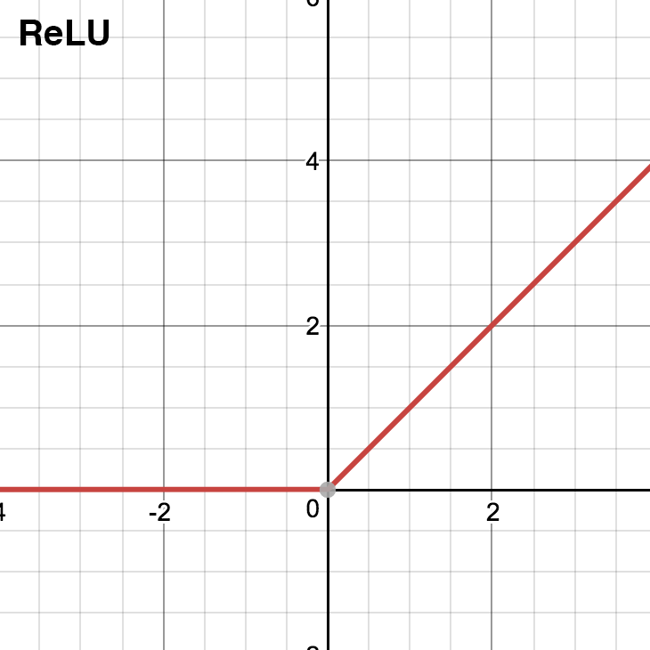
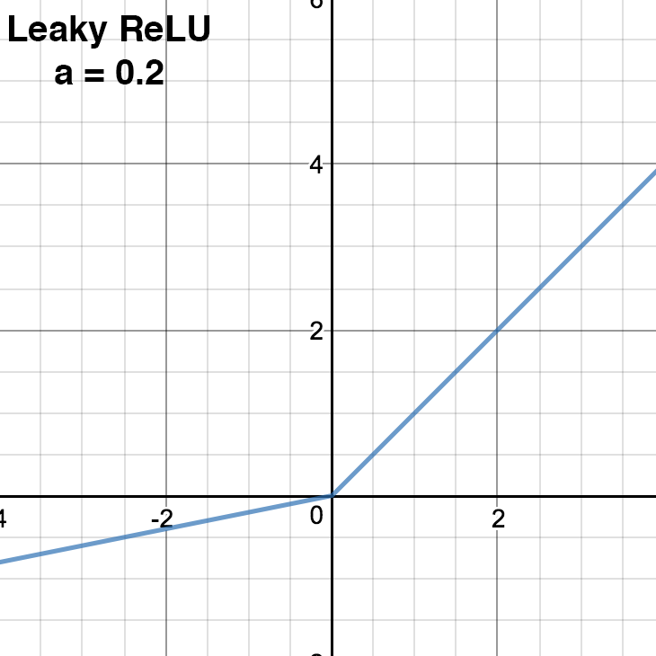
:::

```python
def lrelu(x, a):
    ''' Leaky ReLU.
        x is our tensor.
        a is the magnitude of negative slope for x < 0.
    '''
    return (0.5 * (1 + a)) * x + (0.5 * (1 - a)) * tf.abs(x)
```

### Batch Normalization

Batch Normalization is a cool general technique for improving training. All it does is normalize the input to a layer for mean and variance, while also including a trainable bias and scale parameter that allows the amount of normalization to be adjusted. From [the paper](https://arxiv.org/pdf/1502.03167.pdf) where it was introduced:

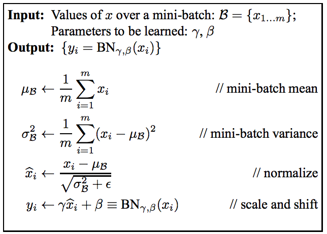

If $\gamma \approx \sigma$ and $\beta \approx \mu$ then the transformation becomes an identity, allowing the NN to disable the behavior if not beneficial. In general, however, it allows for higher learning rates, reduces the need for dropout as it has a regularizing effect, and reduces dependence on initialization.

```python
def batchnorm(inp):
    ''' Batch Normalization. '''
    with tf.variable_scope("batchnorm"):
        channels = inp.get_shape()[3]
        offset = tf.get_variable("offset",
                                 [channels],
                                 dtype=tf.float32,
                                 initializer=tf.zeros_initializer())
        scale = tf.get_variable("scale",
                                [channels],
                                dtype=tf.float32,
                                initializer=tf.random_normal_initializer(1.0, 0.02))

        mean, variance = tf.nn.moments(inp, axes=[0, 1, 2], keep_dims=False)
        variance_epsilon = 1e-5
        normalized = tf.nn.batch_normalization(inp, mean, variance,
                                               offset, scale, variance_epsilon=variance_epsilon)
        return normalized
```

Now with that out of the way, lets get to actually building our model. Like all GAN architectures, our model will have a generator and discriminator. Let's start with the generator.

## Generator


](img/units.png)

The generator is made up of a series of convolution layers, followed by a series of deconvolution layers. This has an effect similar to an autoencoder, where the model is forced to compress the 256x256x3 image into a single 1x1x256 vector keeping only the most important parts of the image before upsampling it again with the deconvolution layers. However, often with these image-to-image translation tasks larger structural features are the same in both input and target, so the model has skip layers where layers from the convolution are inputted into their opposite deconvolution layer, allowing this information to transfer.

Each layer in the encoder gets leaky ReLU and and decoder layers get normal ReLU and dropout. Both get batch normalization.

```python
# Num of generator filters
NGF = 64
def create_generator(generator_inputs):
    """ Create generator network. """
    layers = []

    ### ENCODER ###

    # encoder 1: [batch, 256, 256, 3] => [batch, 128, 128, NGF]
    with tf.variable_scope("encoder_1"):
        output = conv(generator_inputs, NGF, stride=2)
        layers.append(output)

    layer_specs = [
        NGF * 2,  # encoder 2: [batch, 128, 128, ngf] => [batch, 64, 64, ngf * 2]
        NGF * 4,  # encoder 3: [batch, 64, 64, ngf * 2] => [batch, 32, 32, ngf * 4]
        NGF * 8,  # encoder 4: [batch, 32, 32, ngf * 4] => [batch, 16, 16, ngf * 8]
        NGF * 8,  # encoder 5: [batch, 16, 16, ngf * 8] => [batch, 8, 8, ngf * 8]
        NGF * 8,  # encoder 6: [batch, 8, 8, ngf * 8] => [batch, 4, 4, ngf * 8]
        NGF * 8,  # encoder 7: [batch, 4, 4, ngf * 8] => [batch, 2, 2, ngf * 8]
        NGF * 8,  # encoder 8: [batch, 2, 2, ngf * 8] => [batch, 1, 1, ngf * 8]
    ]

    for out_channels in layer_specs:
        with tf.variable_scope("encoder_{}".format(len(layers) + 1)):
            rectified = lrelu(layers[-1], 0.2)
            convolved = conv(rectified, out_channels, stride=2)
            output = batchnorm(convolved)
            layers.append(output)

    ### DECODER ###

    # (channels, dropout probability)
    layer_specs = [
        (NGF * 8, 0.5),  # decoder 8: [batch, 1, 1, ngf * 8] => [batch, 2, 2, ngf * 8 * 2]
        (NGF * 8, 0.5),  # decoder 7: [batch, 2, 2, ngf * 8 * 2] => [batch, 4, 4, ngf * 8 * 2]
        (NGF * 8, 0.5),  # decoder 6: [batch, 4, 4, ngf * 8 * 2] => [batch, 8, 8, ngf * 8 * 2]
        (NGF * 8, 0.0),  # decoder 5: [batch, 8, 8, ngf * 8 * 2] => [batch, 16, 16, ngf * 8 * 2]
        (NGF * 4, 0.0),  # decoder 4: [batch, 16, 16, ngf * 8 * 2] => [batch, 32, 32, ngf * 4 * 2]
        (NGF * 2, 0.0),  # decoder 3: [batch, 32, 32, ngf * 4 * 2] => [batch, 64, 64, ngf * 2 * 2]
        (NGF, 0.0),  # decoder 2: [batch, 64, 64, ngf * 2 * 2] => [batch, 128, 128, ngf * 2]
    ]

    num_encoder_layers = len(layers)
    for decoder_layer, (out_channels, dropout) in enumerate(layer_specs):
        # Encoder layer to concat with to create skip connection
        skip_layer = num_encoder_layers - decoder_layer - 1
        with tf.variable_scope("decoder_{}".format(skip_layer + 1)):
            if decoder_layer == 0:
                # First decoder layer doesn't have skip connections
                inp = layers[-1]
            else:
                inp = tf.concat([layers[-1], layers[skip_layer]], axis=3)

            rectified = tf.nn.relu(inp)
            output = deconv(rectified, out_channels)
            output = batchnorm(output)

            if dropout > 0.0:
                output = tf.nn.dropout(output, keep_prob=1 - dropout)

            layers.append(output)

    # decoder 1: [batch, 128, 128, ngf * 2] => [batch, 256, 256, 3]
    with tf.variable_scope("decoder_1"):
        inp = tf.concat([layers[-1], layers[0]], axis=3)
        rectified = tf.nn.relu(inp)
        output = deconv(rectified, 3)
        output = tf.tanh(output)
        layers.append(output)

    return layers[-1]
```

## Discriminator

](img/discriminator.png)

Next up is our discriminator, which is a lot simpler than the generator. The discriminator receives an input (a labeled facade in this case) and a generated or real output for that input that it has to gauge the legitimacy of. It is made up of a series of convolutions outputting a single probability of being "real" from a sigmoid at the end. Each layer gets batch normalization and leaky ReLU.

```python
# Number of discriminator filters
NDF = 64
def create_discriminator(discrim_inputs, discrim_targets):
    n_layers = 3
    layers = []

    # 2x [batch, height, width, 3] => [batch, height, width, 6]
    inp = tf.concat([discrim_inputs, discrim_targets], axis=3)

    # layer 1: [batch, 256, 256, 6] => [batch, 128, 128, ndf]
    with tf.variable_scope("layer_1"):
        convolved = conv(inp, NDF, stride=2)
        rectified = lrelu(convolved, 0.2)
        layers.append(rectified)

    # layer 2: [batch, 128, 128, ndf] => [batch, 64, 64, ndf * 2]
    # layer 3: [batch, 64, 64, ndf * 2] => [batch, 32, 32, ndf * 4]
    # layer 4: [batch, 32, 32, ndf * 4] => [batch, 31, 31, ndf * 8]
    for i in range(n_layers):
        with tf.variable_scope("layer_{}".format(len(layers) + 1)):
            out_channels = NDF * min(2 ** (i + 1), 8)
            stride = 1 if i == n_layers - 1 else 2  # Last layer here has stride 1
            convolved = conv(layers[-1], out_channels, stride=stride)
            normalized = batchnorm(convolved)
            rectified = lrelu(normalized, 0.2)
            layers.append(rectified)

    # layer_5: [batch, 31, 31, ndf * 8] => [batch, 30, 30, 1]
    with tf.variable_scope("layer_{}".format(len(layers) + 1)):
        convolved = conv(rectified, out_channels=1, stride=1)
        output = tf.sigmoid(convolved)
        layers.append(output)

    return layers[-1]
```

## Loss & Optimizer

The discriminator's loss is simple, just minimize giving the wrong label, similar to a normal GAN.

For the generator, we have two losses. The first is the standard GAN loss, try to minimize the discriminator detecting that the generated image is fake. The second loss is an L1 loss that tries to minimize the differences between generated and target image, since they should be as similar as possible. L2 loss is also sometimes used here, but the paper notes L1 loss produces less blurring. We then linearly combine these two losses to get our total generator loss.

```python
# Val used to prevent 0 erros in log
EPS = 1e-12
# Weights for the two GAN losses
GAN_WEIGHT = 1.
L1_WEIGHT = 100.
# Optimizer params
LR = 0.0002
BETA1 = 0.5
def build_model(inputs, targets):
    with tf.variable_scope("generator"):
        outputs = create_generator(inputs)

    with tf.variable_scope("discriminator"):
        predict_real = create_discriminator(inputs, targets)

    with tf.variable_scope("discriminator", reuse=True):
        predict_fake = create_discriminator(inputs, outputs)

    # Discriminator loss
    discrim_loss = tf.reduce_mean(-(tf.log(predict_real + EPS) + tf.log(1 - predict_fake + EPS)))

    # Generator loss
    gen_loss_gan = tf.reduce_mean(-tf.log(predict_fake + EPS))
    gen_loss_l1 = tf.reduce_mean(tf.abs(targets - outputs))
    gen_loss = gen_loss_gan * GAN_WEIGHT + gen_loss_l1 * L1_WEIGHT

    # Discriminator train op
    discrim_tvars = [var for var in tf.trainable_variables() if var.name.startswith("discriminator")]
    discrim_optim = tf.train.AdamOptimizer(LR, BETA1)
    discrim_grads_and_vars = discrim_optim.compute_gradients(discrim_loss, var_list=discrim_tvars)
    discrim_train = discrim_optim.apply_gradients(discrim_grads_and_vars)

    # Generator train op
    with tf.control_dependencies([discrim_train]):
        gen_tvars = [var for var in tf.trainable_variables() if var.name.startswith("generator")]
        gen_optim = tf.train.AdamOptimizer(LR, BETA1)
        gen_grads_and_vars = gen_optim.compute_gradients(gen_loss, var_list=gen_tvars)
        gen_train = gen_optim.apply_gradients(gen_grads_and_vars)

    # Decay gradient over time
    ema = tf.train.ExponentialMovingAverage(decay=0.99)
    update_losses = ema.apply([discrim_loss, gen_loss_gan, gen_loss_l1])

    # Incrementing global step
    global_step = tf.contrib.framework.get_or_create_global_step()
    incr_global_step = tf.assign(global_step, global_step + 1)

    # We don't include discrim_train in the group bb it's a dependency of gen_train
    train_op = tf.group(update_losses, incr_global_step, gen_train)
    return outputs, train_op, gen_loss, discrim_loss
```

## Train

Training is pretty straightforward, however, one thing to note here is that unlike prior models I've written up this definitely requires a GPU if you're going to do the full 200 epochs, or you'll be waiting a while.

Instead of a normal `Session` we'll use a `managed_session` which handles initialization & other bookkeeping.

```python
import time

# How often to print progress/save
PROG_F = 50
SAVE_F = 5000

MAX_EPOCHS = 200
OUT_DIR = 'out'
def train(train_op, outputs, gen_loss, discrim_loss, steps_per_epoch):
    """ Train model. """
    max_steps = MAX_EPOCHS * steps_per_epoch
    saver = tf.train.Saver(max_to_keep=1)
    sv = tf.train.Supervisor(logdir=OUT_DIR, save_summaries_secs=0, saver=None)
    with sv.managed_session() as sess:
        start = time.time()

        for step in range(max_steps):
            def should(freq):
                return freq > 0 and ((step + 1) % freq == 0 or step == max_steps - 1)

            fetches = {
                "train": train_op,
                "global_step": sv.global_step,
            }

            if should(PROG_F):
                fetches["discrim_loss"] = discrim_loss
                fetches["gen_loss"] = gen_loss

            results = sess.run(fetches)

            if should(PROG_F):
                train_epoch = math.ceil(results["global_step"] / steps_per_epoch)
                train_step = (results["global_step"] - 1) % steps_per_epoch + 1
                rate = (step + 1) * BATCH_SIZE / (time.time() - start)
                remaining = (max_steps - step) * BATCH_SIZE / rate
                print(("progress  " +
                       "epoch {}  " +
                       "step {}  " +
                       "image/sec {:0.1f} " +
                       "remaining {}m").format(train_epoch, train_step, rate, int(remaining / 60)))

                print("discrim_loss", results["discrim_loss"])
                print("gen_loss_GAN", results["gen_loss"])

            if should(SAVE_F):
                print("saving model")
                saver.save(sess, os.path.join(OUT_DIR, "model"), global_step=sv.global_step)

            if sv.should_stop():
                break
        saver.save(sess, os.path.join(OUT_DIR, "model"), global_step=sv.global_step)

paths, inputs, targets, steps_per_epoch = load_data('data/pix2pix/facades/train')
outputs, train_op, gen_loss, discrim_loss = build_model(inputs, targets)
train(train_op, outputs, gen_loss, discrim_loss, steps_per_epoch)
```

## Evaluating

Because of the way we're feeding in data, evaluating is a little different. We'll clear out everything, remake our model with the `val` data as input instead, and load in our trained parameters. From there, running is exactly the same except now we write out the images produced.

Note: You can't define the model twice, so don't run the `train` cell above followed by this one. You have to start fresh and choose one or the other. I'm brushing that aside for general clarity of this post, but check out the full code if you actually want to run this.

```python
OUT_DIR = 'out'
def save_images(results):
    """ Save images from results. """
    for i, in_path in enumerate(results["paths"]):
        num, _ = os.path.splitext(os.path.basename(in_path.decode('utf8')))
        for kind in ["inputs", "outputs", "targets"]:
            filename = f"{num}-{kind}.png"
            out_path = os.path.join(image_dir, filename)
            contents = results[kind][i]
            with open(out_path, "wb") as f:
                f.write(contents)

def deprocess_image(img):
    ''' Turn output pixel values back into a normal image. '''
    img = (img + 1) / 2
    return tf.image.convert_image_dtype(img, dtype=tf.uint8, saturate=True)

def test(paths, inputs, targets, outputs, steps_per_epoch):
    """ Evaluate model on test images. """
    output_images = {
        "paths": paths,
        "inputs": tf.map_fn(tf.image.encode_png, deprocess_image(inputs),
                            dtype=tf.string, name="inputs_pngs"),
        "targets": tf.map_fn(tf.image.encode_png, deprocess_image(targets),
                            dtype=tf.string, name="target_pngs"),
        "outputs": tf.map_fn(tf.image.encode_png, deprocess_image(outputs),
                            dtype=tf.string, name="output_pngs"),
    }

    saver = tf.train.Saver()
    sv = tf.train.Supervisor(logdir=OUT_DIR, save_summaries_secs=0, saver=None)
    with sv.managed_session() as sess:
        # Restore from checkpoint
        checkpoint = tf.train.latest_checkpoint(OUT_DIR)
        saver.restore(sess, checkpoint)
        # Save outputs
        for step in range(steps_per_epoch):
            results = sess.run(output_images)
            save_images(results)

paths, inputs, targets, steps_per_epoch = load_data('data/pix2pix/facades/val')
outputs, _, _, _ = build_model(inputs, targets)
test(paths, inputs, targets, outputs, steps_per_epoch)
```

## Results

:::{.center}
| Input                 | Generated              | Target                 |
|-----------------------|------------------------|------------------------|
| 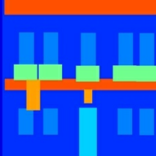| 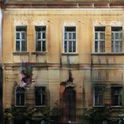 |  |
| 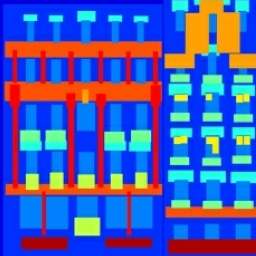| 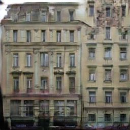 | 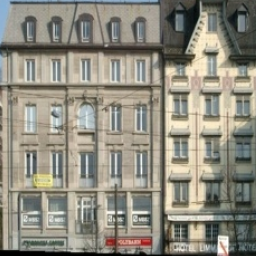 |
| 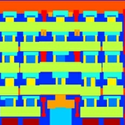| 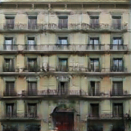 |  |
:::
