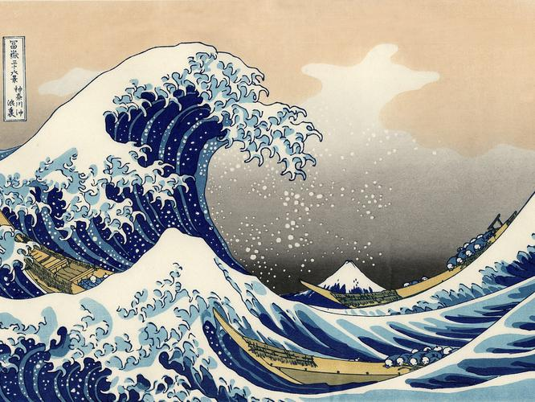

In this post I'm going to walk through Style Transfer using the method described in [Gatys et al. 2015](https://arxiv.org/pdf/1508.06576v2.pdf) with the [VGG Very-Deep 19](http://www.robots.ox.ac.uk/~vgg/research/very_deep/) model as the source for filter weights.

We will be taking two images and attemp to transfer the style of one to the other, without losing the content of the recieving image. See the following example (more included at bottom of the post):

| Content             | Style                     | Output            |
|:-------------------:|:-------------------------:|:-----------------:|
|  |  |  |

Code adapted from [Stanford CS20SI](http://web.stanford.edu/class/cs20si/).

## Setup

```python
import numpy as np
import tensorflow as tf
import scipy.io

def vgg_weights(vgg_layers, layer):
    """ Return the weights and biases already trained by VGG.
    This is all related to the format of the VGG model and isn't that interesting.
    """
    W = vgg_layers[0][layer][0][0][2][0][0]
    b = vgg_layers[0][layer][0][0][2][0][1]
    return W, b.reshape(b.size)

def conv2d_relu(vgg_layers, prev_layer, layer):
    """ Return the Conv2D layer with RELU using the weights, biases from the VGG
    model at 'layer'.
    Inputs:
        vgg_layers: holding all the layers of VGGNet
        prev_layer: the output tensor from the previous layer
        layer: the index to current layer in vgg_layers

    Output:
        relu applied on the convolution.
    """
    # Get the weights from the vgg model for the current layer
    W, b = vgg_weights(vgg_layers, layer)

    # These are consts because they're already trained, we won't be changing them
    W = tf.constant(W, name='weights')
    b = tf.constant(b, name='bias')

    conv2d = tf.nn.conv2d(prev_layer, filter=W, strides=[1, 1, 1, 1], padding='SAME')
    return tf.nn.relu(conv2d + b)

def avgpool(prev_layer):
    """ Return the average pooling layer. The paper suggests that average pooling
    actually works better than max pooling.
    Input:
        prev_layer: the output tensor from the previous layer

    Output:
        the output of the tf.nn.avg_pool() function.
    """
    return tf.nn.avg_pool(prev_layer, ksize=[1, 2, 2, 1], strides=[1, 2, 2, 1],
                          padding='SAME', name='avg_pool_')
```

## Building The Graph

The first thing we do is load in the pre-trained weights from the VGG model. We then create the image variable that we'll be styling. Using the functions defined above, we run the image variable through the layers of convolution and pooling, saving the value at each step.

Note: The reason the layer numbers jump around is we skip layers (1,3,4,6, ... etc.) that represent the pooling and ReLU which we are performing ourselves.

```python
# Output image size
# Larger images will take longer to train &
# may not work as well as VGG was trained on small imgs
IMAGE_HEIGHT = 500
IMAGE_WIDTH = 666

# Use variable instead of placeholder because we're training the intial image to make it
# look like both the content image and the style image
input_image = tf.Variable(np.zeros([1, IMAGE_HEIGHT, IMAGE_WIDTH, 3]), dtype=tf.float32)

# Load in weights from the pre-trained vgg model
vgg = scipy.io.loadmat('data/vgg19.mat')
vgg_layers = vgg['layers']

# Build up our graph, passing the input_image through our trained weights
graph = {}
graph['conv1_1']  = conv2d_relu(vgg_layers, input_image, 0)
graph['conv1_2']  = conv2d_relu(vgg_layers, graph['conv1_1'], 2)
graph['avgpool1'] = avgpool(graph['conv1_2'])
graph['conv2_1']  = conv2d_relu(vgg_layers, graph['avgpool1'], 5)
graph['conv2_2']  = conv2d_relu(vgg_layers, graph['conv2_1'], 7)
graph['avgpool2'] = avgpool(graph['conv2_2'])
graph['conv3_1']  = conv2d_relu(vgg_layers, graph['avgpool2'], 10)
graph['conv3_2']  = conv2d_relu(vgg_layers, graph['conv3_1'], 12)
graph['conv3_3']  = conv2d_relu(vgg_layers, graph['conv3_2'], 14)
graph['conv3_4']  = conv2d_relu(vgg_layers, graph['conv3_3'], 16)
graph['avgpool3'] = avgpool(graph['conv3_4'])
graph['conv4_1']  = conv2d_relu(vgg_layers, graph['avgpool3'], 19)
graph['conv4_2']  = conv2d_relu(vgg_layers, graph['conv4_1'], 21)
graph['conv4_3']  = conv2d_relu(vgg_layers, graph['conv4_2'], 23)
graph['conv4_4']  = conv2d_relu(vgg_layers, graph['conv4_3'], 25)
graph['avgpool4'] = avgpool(graph['conv4_4'])
graph['conv5_1']  = conv2d_relu(vgg_layers, graph['avgpool4'], 28)
graph['conv5_2']  = conv2d_relu(vgg_layers, graph['conv5_1'], 30)
graph['conv5_3']  = conv2d_relu(vgg_layers, graph['conv5_2'], 32)
graph['conv5_4']  = conv2d_relu(vgg_layers, graph['conv5_3'], 34)
graph['avgpool5'] = avgpool(graph['conv5_4'])
```

## Making Images

We start by loading in our `STYLE_IMAGE` and `CONTENT_IMAGE`. For the example, I use a picture of Blueno and Starry Night by Picasso:

:::{.flex}


:::

We crop as necessary and subtract out `MEAN_PIXELS` since the VGG model was trained on mean normalized pixel values.

Finally, we generate the slightly noised version of the `CONTENT_IMAGE` that we're going to generate the style of:


```python
from PIL import Image, ImageOps
def get_resized_image(img_path, height, width):
    image = Image.open(img_path)
    image = ImageOps.fit(image, (width, height), Image.ANTIALIAS)
    image = np.asarray(image, np.float32)
    return np.expand_dims(image, 0)

def generate_noise_image(content_image, height, width, noise_ratio=0.6):
    """Take our content image and fuzz it a bit
    """
    noise_image = np.random.uniform(-20, 20,
                                    (1, height, width, 3)).astype(np.float32)
    return noise_image * noise_ratio + content_image * (1 - noise_ratio)

# parameters to manage experiments
STYLE_IMAGE = 'styles/starry_night.jpg'
CONTENT_IMAGE = 'content/blueno.jpg'

MEAN_PIXELS = np.array([123.68, 116.779, 103.939]).reshape((1,1,1,3))
""" MEAN_PIXELS is defined according to description on their github:
https://gist.github.com/ksimonyan/211839e770f7b538e2d8
'In the paper, the model is denoted as the configuration D
trained with scale jittering. The input images should be zero-centered
by mean pixel (rather than mean image) subtraction.
Namely, the following BGR values should be subtracted: [103.939, 116.779, 123.68].'
"""

content_image = get_resized_image(CONTENT_IMAGE, IMAGE_HEIGHT, IMAGE_WIDTH)
content_image = content_image - MEAN_PIXELS

style_image = get_resized_image(STYLE_IMAGE, IMAGE_HEIGHT, IMAGE_WIDTH)
style_image = style_image - MEAN_PIXELS

# percentage weight of the noise for intermixing with the content image
NOISE_RATIO = 0.6
initial_image = generate_noise_image(content_image, IMAGE_HEIGHT, IMAGE_WIDTH, NOISE_RATIO)
```

## Defining Loss

This is where the meat of the algorithm lies. Our goal is to create an image that has the style of one image and the content of another, so we should define our loss with this in mind. One way to express this total loss is as a linear combination of the style loss and content loss. We can then play around with the ratio to find a result that balances the two nicely.

$$\begin{align*}
    \vec{p} &= \text{The picture we want the content of} \\
    \vec{a} &= \text{The art we want the style of} \\
    \vec{x} &= \text{The resulting image we generate} \\
    \mathcal{L}_{total}(\vec{p}, \vec{a}, \vec{x}) &= \alpha \mathcal{L}_{content}(\vec{p}, \vec{x}) + \beta \mathcal{L}_{style}(\vec{a}, \vec{x})
\end{align*}$$

### Content Loss

The paper defines content loss as follows:

Let us define $F^l$ as the activation of layer $l$ in response to our generated image $\vec{x}$. $F^l_{ij}$ then represents the activation of the $i$th filter at position $j$ in layer $l$. We can similarly define $P^l_{ij}$, but for the original image rather than our generated one.

We can then define the loss as the squared error between these values:

$$ \mathcal{L}_{content}(\vec{p}, \vec{x}, l) = \frac{1}{2} \sum \limits_{i,j} (F^l_{ij} - P^l_{ij})^2 $$

where $l$ is the layer we choose to measure the loss on. For the implementation shown in the notebook, `conv4_2` is chosen.

It makes sense that this would be a good measure of content loss; two similar images should activate the CNN similarly. The paper additionally argues for using higher layers of the CNN to measure this loss. Lower layers are very close to the original pixel values, so encode much of the original image (including its style). Higher layers on the other hand are closer to the classification of the image and focus more on structural features, therefore being more a measure of content than style.

The paper backs up this reasoning by taking images of random noise and trying to train them so as to minimize the content loss. When the content loss is measured on lower layers, the result is almost pixel-perfect to the original image. Higher layers, however, lose some of the pixel content but are still maintain the overall look of the picture. See the figure at the bottom of this cell for illustration.

### Style Loss

Now on to style loss. This was definitely the most confusing part of the algorithm. The paper defines style loss as follows:

Let us define $F$ the same as we did for content loss. Let us consider $G^l$, the Gram matrix for the set of filters in the layer $l$:

$$ G^l_{ij} = \sum\limits_k F^l_{ik} F^l_{jk} $$

This is esstentially all possible dot products between any two filters of the layer. We then consider $A$ as similarly defined, but for our style image $\vec{a}$ rather than our generated image $\vec{x}$. Let us also define $N_l$ as the number of filters a layer $l$ has and $M_l$ to be the size of each one of these filters. The style loss for a particular layer $l$ is then defined as

$$ E_l = \frac{1}{4N^2_l M^2_l} \; \; \sum\limits_{i,j} (G^l_{ij} - A^l_{ij})^2 $$

We then linearly combine the style loss of each layer, each with their own weight $w_l$:

$$ \mathcal{L}_{style}(\vec{a}, \vec{x}) = \sum\limits_{l=0}^L w_l E_l $$

Phew that was confusing. Unlike content loss, I don't have as good of an intuitive understanding of how this works, and based on searches online I'm not alone. Generally, this distance between Gram matrices seems to measure the correlation of features in such a way that isn't spatially dependent and doesn't pick up on a lot of content.

The paper argues for this measure of style loss with the figure below. It seems if you try to reconstruct an image from noise by minimizing this loss, you get results that show a similar style but don't have features that correspond spatially to the original image. Additionally, as you use higher layers, you get a result that depicts larger and larger scale style.


```python
def gram_matrix(F, N, M):
    """ Create and return the gram matrix for tensor F
    """
    F = tf.reshape(F, (M, N))
    return tf.matmul(tf.transpose(F), F)

def single_style_loss(a, g):
    """ Calculate the style loss at a certain layer
    Inputs:
        a is the feature representation of the real image
        g is the feature representation of the generated image
    Output:
        the style loss at a certain layer (which is E_l in the paper)
    """
    N = a.shape[3] # number of filters
    M = a.shape[1] * a.shape[2] # height times width of the feature map
    A = gram_matrix(a, N, M)
    G = gram_matrix(g, N, M)
    return tf.reduce_sum((G - A) ** 2 / ((2 * N * M) ** 2))

# Layers used for style features.
STYLE_LAYERS = ['conv1_1', 'conv2_1', 'conv3_1', 'conv4_1', 'conv5_1']
W = [0.5, 1.0, 1.5, 3.0, 4.0] # give more weights to deeper layers.

with tf.Session() as sess:
    sess.run(input_image.assign(style_image))
    A = sess.run([graph[layer_name] for layer_name in STYLE_LAYERS])

# Get layer losses
E = [single_style_loss(A[i], graph[STYLE_LAYERS[i]]) for i in range(len(STYLE_LAYERS))]
# Linearly combine layer losses
n_layers = len(STYLE_LAYERS)
graph['style_loss'] = sum([W[i] * E[i] for i in range(n_layers)])


# Layer used for content features.
CONTENT_LAYER = 'conv4_2'

with tf.Session() as sess:
    # assign content image to the input variable
    sess.run(input_image.assign(content_image))
    p = sess.run(graph[CONTENT_LAYER])
f = graph[CONTENT_LAYER]
graph['content_loss'] = tf.reduce_sum((f - p) ** 2) / (4.0 * p.size)

CONTENT_WEIGHT = 0.01
STYLE_WEIGHT = 1
graph['total_loss'] = CONTENT_WEIGHT * graph['content_loss'] +
                        STYLE_WEIGHT * graph['style_loss']
```

## Training

Now on to the fun stuff! This part is pretty straight forward, just initialize the variables and run the optimizer for 300 iterations! It's set up to report loss & time as well as save out the current generated image at various intervals.

```python
import os
import time

graph['global_step'] = tf.Variable(0, dtype=tf.int32, trainable=False, name='global_step')

LEARNING_RATE = 2.0
graph['optimizer'] = tf.train.AdamOptimizer(LEARNING_RATE).minimize(
                        graph['total_loss'],
                        global_step=graph['global_step'])

ITERS = 300
skip_step = 1
with tf.Session() as sess:
    # Initialize vars
    sess.run(tf.global_variables_initializer())
    # Assign our initial image that we'll be modifying
    sess.run(input_image.assign(initial_image))

    start_time = time.time()
    for index in range(ITERS):
        if index >= 5 and index < 20:
            skip_step = 10
        elif index >= 20:
            skip_step = 20

        sess.run(graph['optimizer'])
        if (index + 1) % skip_step == 0:
            gen_image, total_loss = sess.run([input_image, graph['total_loss']])
            # Readd the mean we subtracted earlier
            gen_image = gen_image + MEAN_PIXELS
            print('Step {}\n   Sum: {:5.1f}'.format(index + 1, np.sum(gen_image)))
            print('   Loss: {:5.1f}'.format(total_loss))
            print('   Time: {}'.format(time.time() - start_time))
            start_time = time.time()

            filename = 'outputs/%d.png' % (index)

            image = gen_image[0] # the image
            image = np.clip(image, 0, 255).astype('uint8')
            scipy.misc.imsave(filename, image)
```

## Results

I've only run this on my laptop CPU where 300 iterations takes a couple hours to finish. Often times you won't see much of a change in the image after the first 100 or so iterations, though.


Some other images I've generated:

| Content             | Style                 | Output            |
|:-------------------:|:---------------------:|:-----------------:|
|  |  |  |
|                     |   |  |
